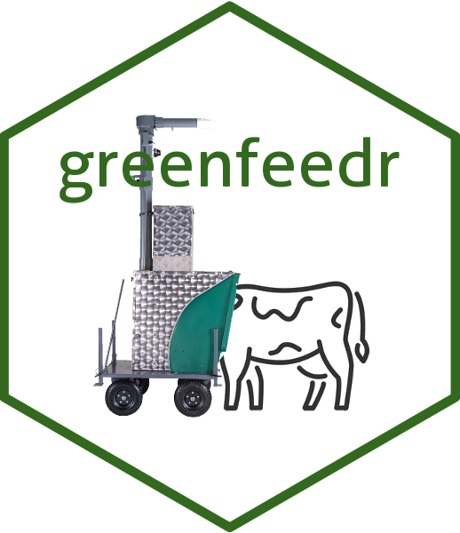

<!-- README.md is generated from README.Rmd. Please edit that file -->

```{r, include = FALSE}
knitr::opts_chunk$set(
  collapse = TRUE,
  comment = "#>",
  fig.path = "man/figures/",
  out.width = "100%"
)
```

# greenfeedr  

<!-- badges: start -->
[](https://CRAN.R-project.org/package=greenfeedr)


<!-- badges: end -->

## Overview

**greenfeedr** is an R package to easily download, evaluate, process, and report GreenFeed data.

| Function | Description |
|---|---|
| `get_gfdata()` | Download GreenFeed data via the C-Lock API |
| `eval_gfparam()` | Evaluate all parameter combinations and select the best filtering settings based on repeatability (ICC) |
| `process_gfdata()` | Process and average GreenFeed records into daily and weekly estimates |
| `report_gfdata()` | Generate summary reports of GreenFeed data |
| `compare_gfdata()` | Compare preliminary and finalized GreenFeed data |
| `pellin()` | Process pellet intakes from GreenFeed units |
| `viseat()` | Process and summarize GreenFeed visit patterns |

## Citation

If you use **greenfeedr** in your research, please cite:

> Martínez-Boggio G, Harrison M, Lutz P (2024). greenfeedr: An R package for processing and reporting GreenFeed data. *Journal of Dairy Science Communications*. <https://doi.org/10.3168/jdsc.2024-0662>

In R, run `citation("greenfeedr")` to get the formatted reference.

> **Note:** If you use `eval_gfparam()` to select filtering parameters, the function automatically prints a ready-to-use methods sentence — including the citation — that you can paste directly into your manuscript.

## Installation

To install the latest stable release from [CRAN](https://CRAN.R-project.org/package=greenfeedr):

```{r CRAN, eval = FALSE}
install.packages("greenfeedr")
```

For the development version with the latest updates:

```{r GitHub, eval = FALSE}
install.packages("remotes")
remotes::install_github("GMBog/greenfeedr")
```

## Recommended workflow

GreenFeed units record gas emissions during voluntary animal visits. Because visit frequency varies across animals and days, the reliability of emission estimates depends on filtering parameters that define the minimum number of records per day (`param1`) and the minimum number of days with records per week (`param2`). The recommended workflow is:

**1. Evaluate parameters** — identify the combination that maximizes repeatability of weekly estimates while retaining enough animals:

```{r eval-params, eval = FALSE}
library(greenfeedr)

data <- get_gfdata(
  username   = "your_username",
  password   = "your_password",
  unit_id    = "your_unit_id",
  start_date = "2024-05-13",
  end_date   = "2024-05-20"
)

eval <- eval_gfparam(
  data       = data,
  start_date = "2024-05-13",
  end_date   = "2024-05-20",
  gas        = "CH4"
)
```

The function prints the suggested parameters, their repeatability (ICC), animal retention, and a **ready-to-paste methods sentence** for your manuscript.

**2. Process data** using the suggested parameters:

```{r process, eval = FALSE}
processed <- process_gfdata(
  data       = data,
  start_date = "2024-05-13",
  end_date   = "2024-05-20",
  param1     = 2,   # use value suggested by eval_gfparam()
  param2     = 3,   # use value suggested by eval_gfparam()
  min_time   = 2
)
```

**3. Report results:**

```{r report, eval = FALSE}
report_gfdata(data = processed)
```

## ShinyApp

Prefer a point-and-click interface? Run the interactive ShinyApp directly on your computer:

```{r run-app, eval = FALSE}
greenfeedr::run_gfapp()
```

The app covers the full workflow — downloading, evaluating parameters, processing, and reporting — without writing any code.

## Tutorials

Step-by-step guides for common workflows:

- [1. Downloading Data](https://github.com/GMBog/greenfeedr/blob/main/inst/md/DownloadData.md)
- [2. Evaluating Parameters](https://github.com/GMBog/greenfeedr/blob/main/inst/md/EvaluateParameters.md)
- [3. Processing Data](https://github.com/GMBog/greenfeedr/blob/main/inst/md/ProcessData.md)
- [4. Reporting Data](https://github.com/GMBog/greenfeedr/blob/main/inst/md/ReportData.md)
- [5. Calculating Pellet Intakes](https://github.com/GMBog/greenfeedr/blob/main/inst/md/PelletIntakes.md)
- [6. Checking Visitation](https://github.com/GMBog/greenfeedr/blob/main/inst/md/Visitation.md)

## Cheat Sheet

<a href="https://github.com/GMBog/greenfeedr/raw/main/man/figures/Cheatsheet.pdf"></a>

## Getting help

If you encounter a bug, please file an issue with a minimal reproducible example on [GitHub](https://github.com/GMBog/greenfeedr/issues).

For questions or feedback, contact [Guillermo Martinez-Boggio](mailto:guillermo.martinezboggio@wisc.edu).


